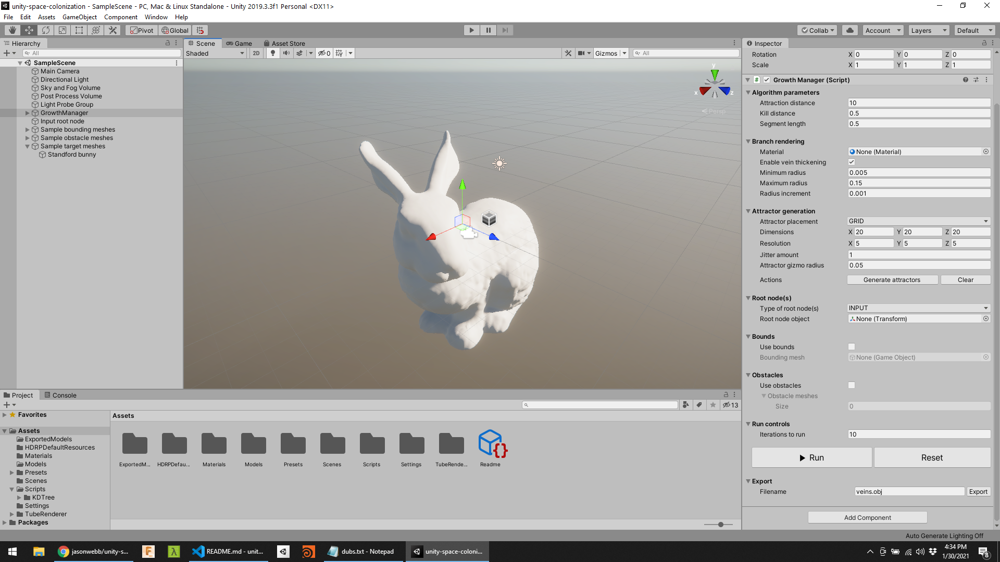

## Requirements

* [TubeRenderer](https://assetstore.unity.com/packages/tools/modeling/tuberenderer-3281) ($10) by Sixth Sensor

## Interface guide

### Algorithm parameters

1. **Attraction distance** - branches that are within this distance (and outside the kill distance) of an attractor will grow towards that attractor.
2. **Kill distance** - how close branches can grow to attraction nodes before stopping.
3. **Segment length** - length of each branch segment of the generated structure. In each iteration of the simulation, one segment is added to the tips of each branch that is not within a kill distance of an attractor.

### Branch rendering

1. **Material** - reference to a material object that is applied to each individual branch segment.
2. **Enable vein thickening** - progressively increase the radius of each branch segment starting from the tip (smallest) to the root node (largest).
    * If enabled ...
      * **Minimum radius** - smallest thickness that a branch can get.
      * **Maximum radius** - largest thickness that a branch can get.
      * **Radius increment** - rate at which the radius changes across each branch segment from tip to root.
    * If disabled ...
      * **Radius** - constant radius for all branch segments.

### Attractor generation

1. **Attractor placement** - dropdown with the following options:
    * **SPHERE**
      * **Radius** - radius of sphere.
      * **Attractor count** - number of attractors to scatter.
    * **GRID** - evenly spaced attractors on a grid.
      * **Dimensions** - length, width, height of grid.
      * **Resolution** - number of attractors per axis.
      * **Jitter** - amount of random displacement per attractor to make them less uniform.
    * **MESH** - scatter attractors on the surface or inside of a custom mesh.
      * **Target mesh** - reference to the mesh you want to use.
      * **Raycasting attempts** - number of times to try casting a random ray. Unity's collision detection is not perfect, so the actual number of attractors that are generated will be much less than this number.
      * **Raycasting direction** - direction to fire random rays for attractor placement.
        * **INWARDS** - casts random rays from outside the mesh towards the origin. Scatters points on the surface.
        * **OUTWARDS** - casts random rays from the origin to the outside. Scatters points on inner surface.
        * **DOME** - casts random rays in a hemisphere around the mesh.
2. **Attractor gizmo radius** - size of the editor gizmos that indicate the position of each attractor.
3. Actions
   * **Generate attractors** - attempt to place attractors using the parameters chosen above. This may take a while depending on the parameters chosen and the complexity of the mesh.
   * **Clear** - remove all attractors from the scene, like a reset.

### Root node(s)

1. **Type of root node(s)** - dropdown with the following options:
    * **INPUT**
      * **Root node object** - reference to the point object you want to use as a root node.
    * **MESH**
      * **Target mesh** - reference to the mesh you want to randomly place root nodes on.
      * **Number of root nodes** - how many randomly-placed root nodes you want.

### Bounds

1. **Use bounds** - enable or disable restriction of branch growth to a chosen bounding volume.
    * If enabled ...
      * **Bounding mesh** - reference to a mesh object you want to use to constrain growth inside of.

### Obstacles

1. **Use obstacles** - enable or disabled the use of obstacle objects that branch growth cannot occur in.
    * If enabled ...
      * **Size** - how many obstacles you want to use.
      * **Element _[n]_** - reference to a mesh object that the branch growth must avoid.

### Run controls

1. **Iterations to run** - number of times to run the simulation. Start small until you know what you're doing!
2. **Run** - press to run the simulation for the number of times chosen above.
3. **Reset** - press to remove any previously-generated branches so growth can start over.

### Export

1. **Filename** - name of the file you want to export. Be sure to provide a file extension.
2. **Export** - press to export the generated branches on the screen to a file with the name provided above.